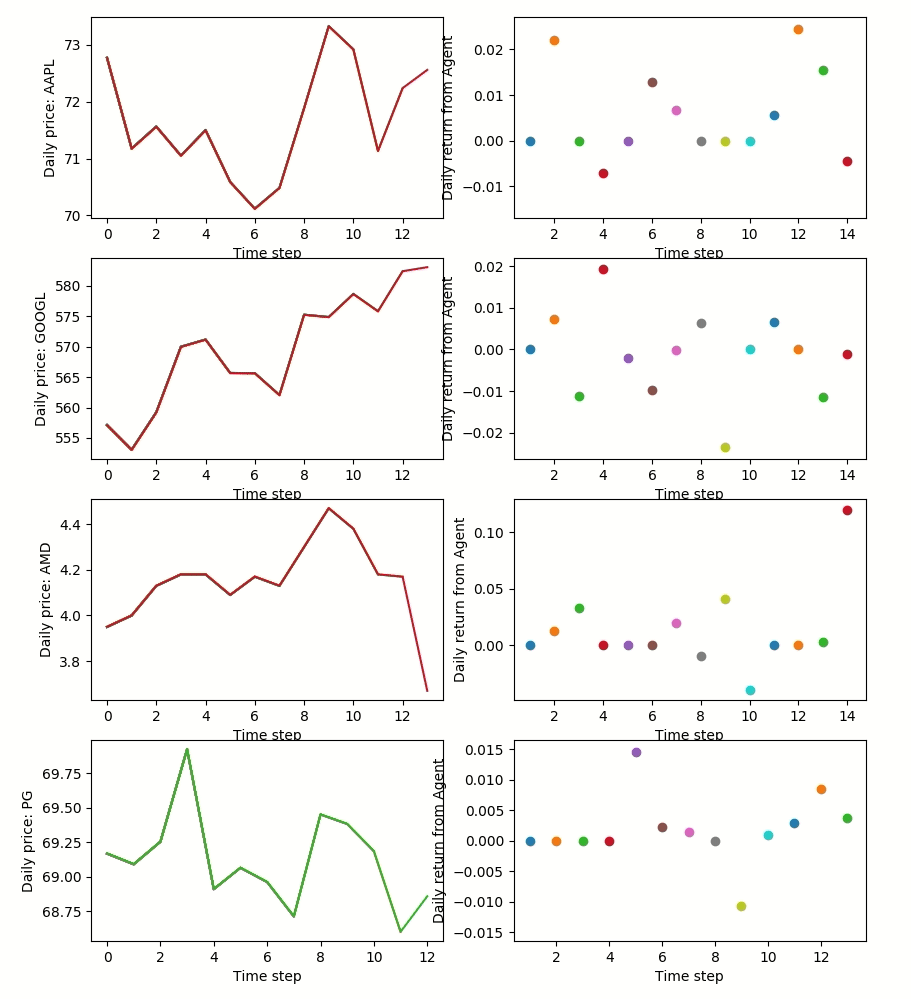

# Gym-Stock-Exchange

Implementing a `stock-exchange` environment in `OPEN-AI`'s [gym](https://gym.openai.com/) environment.

### Getting Started
To get started, you’ll need to have `Python 3.5+` installed. 
Simply install `gym` using pip:
```
pip install gym
```

Once `gym` is installed, clone this repository, then run 
```
python3 demo_exchange.py
```
There are two versions, `discrete` and `continuous` action space - 
agents may require one or the other - DDPG vs naive DQN, for example.
`env = gym.make('game-stock-exchange-v0')` is for a `discrete` environment.
`env = gym.make('game-stock-exchange-continuous-v0')` is for a `continuous` environment.

Code for [continuous](gym_exchange/envs/stock_exchange_continuous.py) and
[discrete](gym_exchange/envs/stock_exchange.py) are found here.

### `TensorFlow`
If you want to integrate `reinforcement learning agents`, I recommend using
[baselines](https://github.com/openai/baselines/), or [stable baselines](https://github.com/hill-a/stable-baselines). 
These are based on `tensorflow`.

### `PyTorch`
If you're a fan of `pytorch`, [stock-exchange-pytorch](https://github.com/wbaik/stock-exchange-pytorch) supports 
implementations for `reinforcement learning` and `supervised learning`. This repository is actually an offshoot 
of that project.

### Examples of Reinforcement Learnings
With a `random agent`, an output of `demo_stock_exchange.py` is like so:



With `stable-baselines`, `Advantage Actor Critic (A2C)` is used in the `demo_exchange.py` to train the model. 
An output of such is like so:


